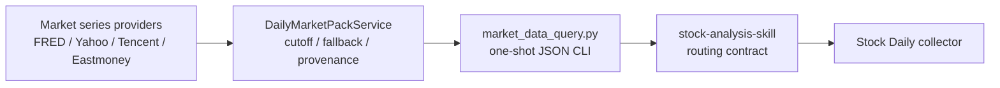

# Daily Market Pack Design

更新时间：2026-07-29

## 架构

## 模块边界

- `src/data_provider/market_series.py`
  - 定义 `MarketSeriesSpec`、`MarketPoint`、`MarketSeriesCandidate`。
  - provider 只负责外部请求和原始点位标准化，不依赖 SQLite。
  - provider 接受统一 UTC `cutoff_at`，只返回截点内的有效点。
- `src/services/daily_market_pack_service.py`
  - 固定日报首批六项指标与 provider policy。
  - 选择完整候选、格式化变化、汇总 provider attempts。
  - 不启动 HTTP，不依赖 repository。
- `src/services/market_data_query_cli.py`
  - 负责参数解析、严格 JSON stdout 和退出码。
  - 当前只开放 `daily-pack`，`persistence` 固定为 `none`。
- `scripts/market_data_query.py`
  - 薄入口。

## Contract

顶层字段：

- `schema_version=market-data-query.v1`
- `status=ok|partial|failed`
- `source=market_data_query`
- `computed_at`
- `request.operation=daily_market_pack`
- `request.cutoff_at`
- `request.persistence=none`
- `summary.requested|succeeded|failed`
- `data.markets`
- `data.failures`

单项行情同时提供：

- 页面兼容字段：`name`、`symbol`、`region`、`value`、`change`、
  `direction`、`note`、`source`、`as_of`
- 机器字段：`kind`、`unit`、`latest_value`、`previous_value`、
  `change_value`、`change_ratio`、`provider`
- 审计字段：`provider_attempts`

## Provider Policy

- SPX / IXIC / DJI / DGS10：并行尝试 FRED 与 Yahoo，选择最新完整候选。
- SSE / CSI300：腾讯证券 -> 东方财富 -> Yahoo，首个完整候选成功即停止。
- provider 失败只进入 `provider_attempts`；全部失败才生成 item failure。

## 截点

- 所有输入解析为带时区的 UTC datetime。
- 中国日线按 `15:00 Asia/Shanghai` 视为完成收盘。
- FRED 日值只接受早于 UTC 截点日期的记录，避免把当日尚未最终确认的值纳入日报。
- Yahoo 日线按返回 timestamp 与 `cutoff_at` 比较。

## 测试

- fake provider 验证 freshest selection、顺序 fallback、失败 contract。
- CLI 测试验证严格 JSON、参数错误和 `persistence=none`。
- Stock Daily 测试用假 CLI 输出验证 contract 映射和异常拒绝。
- 集成验证确认 FastAPI 未启动时 CLI 可独立执行。
